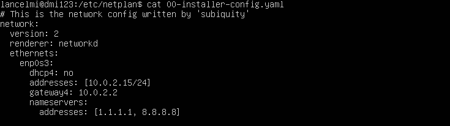
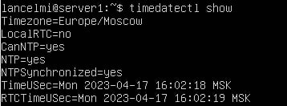
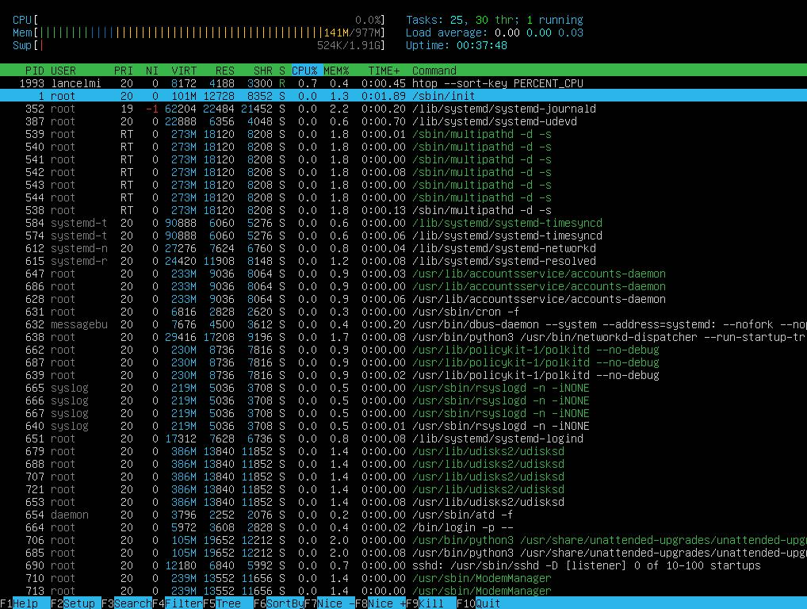
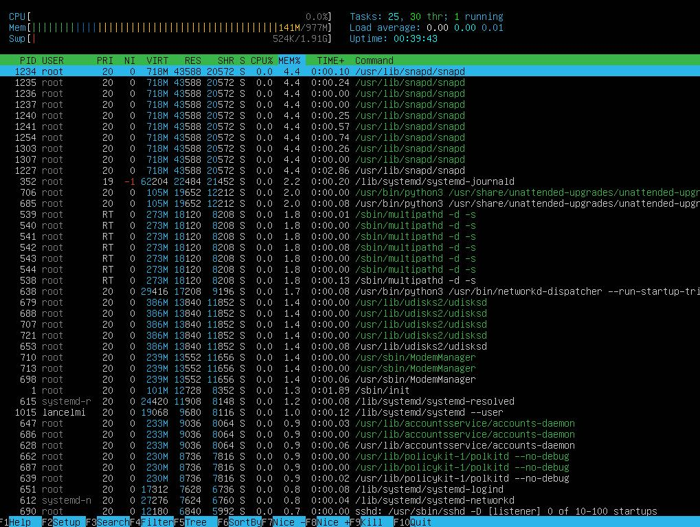
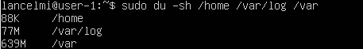
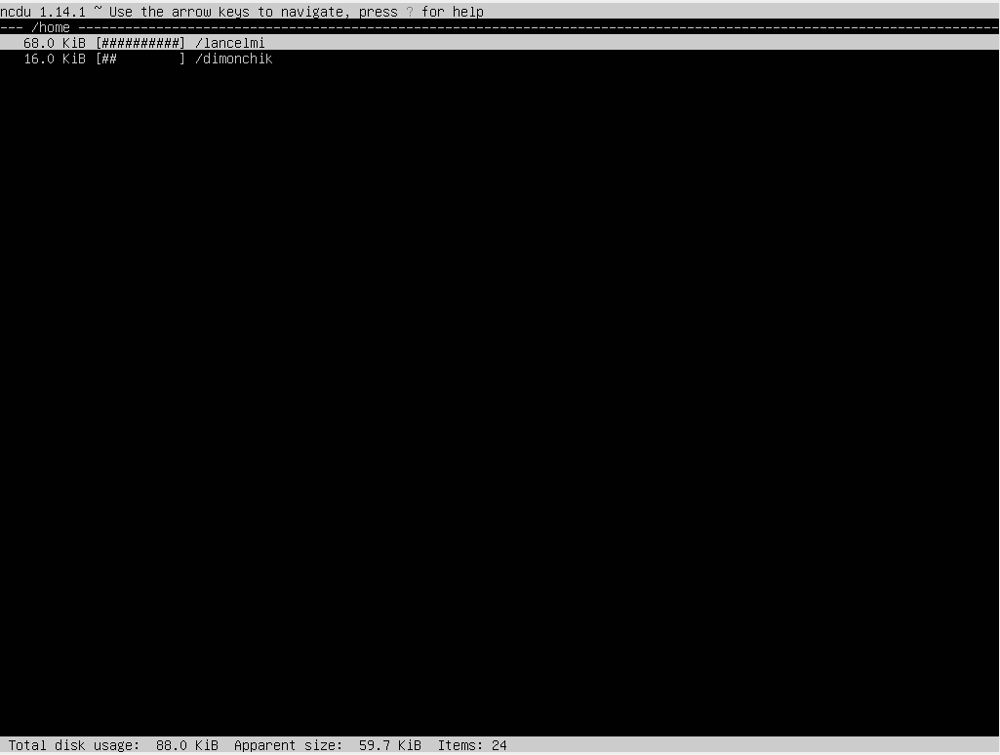

# Операционные системы UNIX/Linux (Базовый)

Установка и обновления системы Linux. Основы администрирования.  

## Часть 1. Установка ОС

- Установка и проверка версии OC \
    

## Часть 2. Создание пользователя  

- Создание нового пользователя \
    

- Добавление его в группу adm и проверка \
  

## Часть 3. Настройка сети OС

- Меняем имя машины \
  

- Установка временной зоны \
  

- Вывод названия сетевых интерфейсов \
  

**lo (loopback device)** – виртуальный интерфейс, присутствующий по умолчанию в любом Linux. Он используется для отладки сетевых программ и запуска серверных приложений на локальной машине. С этим интерфейсом всегда связан адрес 127.0.0.1. У него есть dns-имя – localhost. Посмотреть привязку можно в файле /etc/hosts.

- Вывод внешнего и внутренного IP адреса шлюза \
  

- Вывод IP адреса, полученного от DHCP сервера \
  

**DHCP** — протокол прикладного уровня модели TCP/IP, служит для назначения IP-адреса клиенту. Это следует из его названия — Dynamic Host Configuration Protocol. IP-адрес можно назначать вручную каждому клиенту, то есть компьютеру в локальной сети. Но в больших сетях это очень трудозатратно, к тому же, чем больше локальная сеть, тем выше возрастает вероятность ошибки при настройке. Поэтому для автоматизации назначения IP был создан протокол DHCP.

- Изначальные настройки \
  

- Новые настройки \
  
- Пинги \
  

## Часть 4. Обновление OС

- Проверка что все пакеты находятся в последней версии \
  

## Часть 5. Использование команды **sudo**

- Разрешение пользователю, созданного в части 2, выполнять команду sudo \
  

- Изменение hostname \
  

**Sudo** - позволяет позволяет "подменить" права пользователя до рута, позволяя ему выполнять команды, доступные только для суперпользователя

## Часть 6. Установка и настройка службы времени

- Вывод времени, часового пояса **(timedatectl set-ntp on)** \
  

## Часть 7. Установка и использование текстовых редакторов

- Редактор VIM \
  

- Редактор nano \
  

- Редактор joe \
  

- Создание текстового файла и его сохранение при помощи vim. Для перехода в INSERT MODE используется команда i, для выхода ESC, \
для записи - команда :wq <имя файла>. Сам редактор открывается при помощи команды vim \
  

- Создание текстового файла и его сохранение при помощи nano. Для сохранения текста нажимаем CTRL-O и вводим название файла, затем CTRL-X для выхода. \
Сам редактор открывается при помощи команды nano \
  

- Создание текстового файла и его сохранение при помощи joe. Для сохранения и выхода жмем CTRL и затем пишем KX. \
Сам редактор вызывается при помощи команды joe \
  

- Изменение текстового файла и выход из него при помощи vim. Для выхода без сохранения использовал :q! \
  

- Изменение текстового файла и выход из него при помощи nano. Для выхода жмем CTRL-X, затем жмем N чтобы файл не сохранился \
  

- Изменение текстового файла и выход из него при помощи joe. Для выхода жмем CTRL-C, затем жмем y чтобы файл не сохранился \
  

- Поиск и замена слова при помощи vim. Используется команда вида :%s/<search_term>/<replace_term>/g g - все вхождения, без него только одно \
В моем случае заменяются все слова hello на aboba \
  

- Поиск и замена слова при помощи nano. Жмем CTRL-\\, вводим шаблон, затем чем заменить, можно выбрать интерактивно что заменять, а что нет, можно заменить сразу всё  \

- Поиск и замена слова при помощи joe. Жмем CTRL-K, затем F и пишем нужный шаблон, потом жмем R и пишем шаблон, которым надо поменять\

## Часть 8. Установка и базовая настройка сервиса **SSHD**

- Добавление в автозапуск  
  

- Всё работает \
  

- Перенастройка на 2022 порт \
  

- Всё работает \
  

Ключи **tan**: t - показывает **TCP** соединения (**ssh** работает через tcp), a - все соединения, включая не слушающие, а n выводит в числовом формате \
**State** - слушает сокет или нет, **Local** - локальный адрес, **Foreign** - адрес другого конца сокета (кто подключён).

## Часть 9. Установка и использование утилит **top**, **htop**

- Запуск команды top \
  

  Uptime = 1:11, авторизированных - 1 пользователь, загрузка (load average 0), всего 96 процессов, загрузка процессора - 3.2%, Загрузка памяти - 1.8%, 3951 и 1 соответственно

- Запуск команды htop, с сортировкой по PID **(htop --sort-key PID)** \
  

- Запуск команды htop, с сортировкой по PERCENT_CPU **(htop --sort-key PERCENT_CPU)** \
  

- Запуск команды htop, с сортировкой по PERCENT_MEM **(htop --sort-key PERCENT_MEM)** \
  

- Запуск команды htop, с сортировкой по TIME **(htop --sort-key TIME)**\
  

- Запуск команды htop, с фильтрацией по sshd \
  

- Запуск команды htop с процессом syslog \
  

- Запуск команды htop с hostname и т.д. \
  

## Часть 10. Использование утилиты **fdisk**

- Запуск команды fdisk -l (вывод большой использовал nano, можно через less) \
   \
   \
   \
   \

  Название диска: /dev/sda \
  Размер диска: 26.16 гигабайт \
  Количество секторов: 54853440 \
  Своп: 1999868 килобайт

## Часть 11. Использование утилиты **df**

- Запуск команды df \
  

  Размер раздела: 123355464 \
  Занято: 470040 \
  Доступно: 7006540 \
  Процент использования: 41 \
  Единица измерения: Килобайт
  
- Запуск команды df -Th \
  

  Размер раздела: 12 \
  Занято: 4.5 \
  Доступно: 6.7\
  Процент использования: 41 \
  Единица измерения: гигабайт
  Файловая система: ext4

## Часть 12. Использование утилиты **du**

- Запуск команды du \
  

- Запуск команды du (человекочитаемый вид, в байтах) \
  

- Запуск команды du для каждого вложенного \
  

## Часть 13. Установка и использование утилиты **ncdu**

- Установка команды ncdu \
  
- Память для /home (sudo ncdu /home) \
  
- Память для /var (sudo ncdu /var) \
  
- Память для /var/log (sudo ncdu /var/log) \
  

## Часть 14. Работа с системными журналами

- syslog \
  
- dmesg \
  
- authlog \
  

  Последнее время авторизации: 9 мая 14:34:56 пользователь lancelmi

- Перезапуск ssh и вывод в auth.log \
  

## Часть 15. Использование планировщика заданий **CRON**

- Жмём crontab -e \
  
- Доказательство что команда действительно выполнялась \
  
- Текущие задания для crontab \
  
- Удаление всех заданий из планировщике и вывод (Удалялось командой crontab -r) \
  
